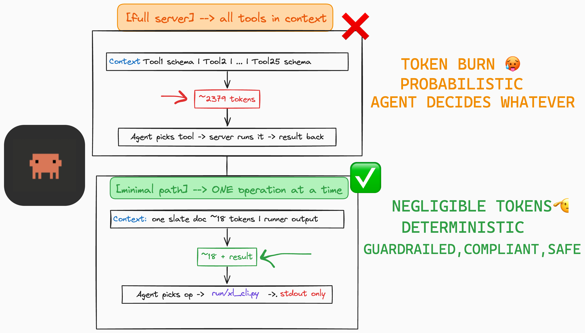

<div align="center">


<h1>Excel Agent Skills</h1>
</div>
<br/>

- **25 Excel ops** (workbook/sheet/data/format/chart/pivot/validation). No Microsoft Excel required (`openpyxl`).
- **Two ways to run:** full server (stdio/SSE/HTTP) with all tool schemas in context, or the minimal path (slate docs plus `run/xl_cli.py` or `run/*.sh`) where you only load one op doc and the runner's stdout.



- Token baselines and how we got them: [analysis/CONTEXT-REPORT.md](analysis/CONTEXT-REPORT.md)

---

## Minimal path (slate + runners)

- Python 3.10+. Paths must be absolute.

```bash
./run/create_workbook.sh /tmp/my.xlsx
./run/create_worksheet.sh /tmp/my.xlsx Sheet2
# or
python3 run/xl_cli.py create_workbook /path/to/file.xlsx
python3 run/xl_cli.py create_worksheet /path/to/file.xlsx Sheet2
```

- Each op has a short doc in `slate/*.md`. The scripts in `run/` (`run/<op>.sh` and `run/xl_cli.py`) use the same logic as the server, just no server process.

## Full server

- Runs over stdio, SSE, or streamable HTTP. See TOOLS.md for how to wire it up.

---

## Ops (25)

| | |
|---|---|
| `create_workbook` | `create_worksheet` |
| `get_workbook_metadata` | `write_data_to_excel` |
| `read_data_from_excel` | `format_range` |
| `merge_cells` | `unmerge_cells` |
| `get_merged_cells` | `apply_formula` |
| `validate_formula_syntax` | `create_chart` |
| `create_pivot_table` | `create_table` |
| `copy_worksheet` | `delete_worksheet` |
| `rename_worksheet` | `copy_range` |
| `delete_range` | `validate_excel_range` |
| `get_data_validation_info` | `insert_rows` |
| `insert_columns` | `delete_sheet_rows` |
| `delete_sheet_columns` | |

## Layout

| Path | Purpose |
|------|--------|
| `slate/` | ~18 tokens per op, one .md per tool |
| `run/` | `xl_cli.py` + `run/<op>.sh` |
| `analysis/` | token counts, baselines, CONTEXT-REPORT |
| `notes/` | when full vs minimal makes sense |


